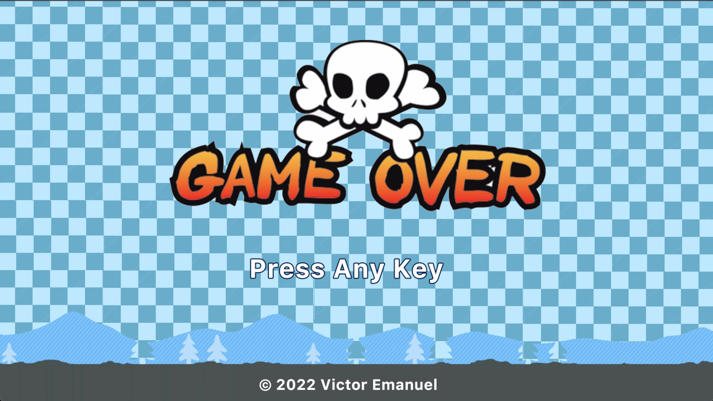

# [](https://github.com/victorkl400/bomberbevy)

[](https://crates.io/crates/bevy)
[](https://github.com/bevyengine/bevy/actions)

## What is BomberBevy?

As you may notice this is a bevy game that tries to copy Superbomberman R, but with low budget.

## WARNING

Bomberbevy is still in the _very_ early stages of development.
Important features are missing.
Documentation is sparse.

## Improvement Goals

- **Audio**: Improve audio plugin/systems
- **Audio**: Add Gameover SFX audio
- **GameOver**: Improve Gameover Screen
- **UI**: Show Bomb amount left
- **Logic**: Improve player upgrades
- **Logic**: Enemy towards player function
- **Logic**: Improve GameOver logic

## Getting Started

Having Rust 1.51.0 or later is a must for runnning this game.

Follow the [Setup guide](https://bevyengine.org/learn/book/getting-started/setup/) to ensure your development environment is set up correctly.

```sh
# Clone the project
git clone https://github.com/victorkl400/bomberbevy.git

# Runs the game on the release mode
cargo run -r
```

## Libraries Used

Bevy is only possible because of the hard work put into these foundational technologies:

- [bevy_egui](https://crates.io/crates/bevy_egui): a fast library to handle UI
- [bevy_rapier3d](https://crates.io/crates/bevy_rapier3d): 2D and 3D physics engines for the Bevy game engine.
- [bevy_kira_audio](https://crates.io/crates/bevy_kira_audio): replace for bevy_audio
- [rand](https://crates.io/crates/rand) a library for random number generation

## Controls

Controls for playing this game

- **W**: Moves the player up
- **A**: Moves the player left
- **S**: Moves the player down
- **D**: Moves the player right
- **Space**: Place bombs

## Map Generation

This game implements a map generation based on a `txt` file placed under `assets/maps`.
Make sure you dont put any block on the Player spawn point.

- **$**: Spawns the Tower wall
- **B**: Spawns a unbreakable Block
- **@**: Spawns a breakable Workbench
- **C**: Spawns a Coin
- **R**: Spawns a Tower
- **#**: Spawns a Middle Tower
- **Empty Space**: Spawns only the default floor

## Screenshots

Screenshots of Gameplay

**GameOver**:

# [](https://github.com/victorkl400/bomberbevy)

**GamePlay**:

# [](https://github.com/victorkl400/bomberbevy)

**MainMenu**:

# [](https://github.com/victorkl400/bomberbevy)
